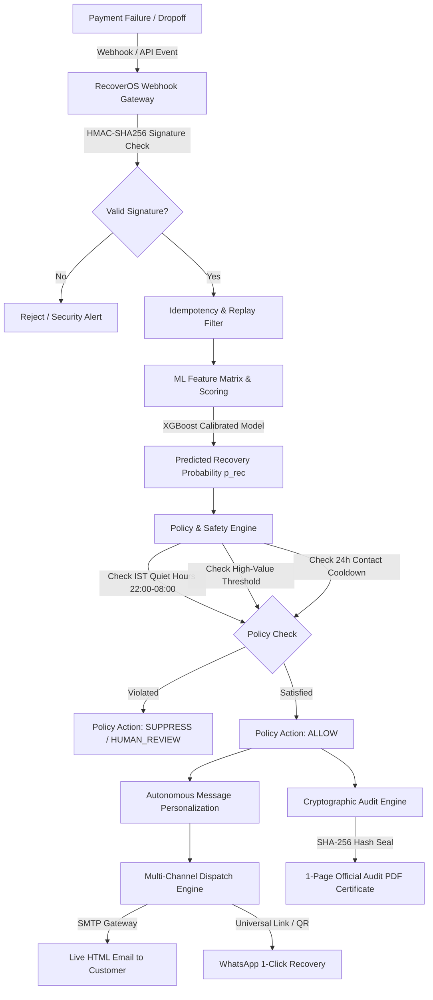

# <svg width="24" height="24" viewBox="0 0 24 24" fill="none" stroke="#FB7185" stroke-width="2.2" stroke-linecap="round" stroke-linejoin="round" style="vertical-align:middle; display:inline-block; margin-right:6px;"><rect width="20" height="14" x="2" y="5" rx="2"/><line x1="2" x2="22" y1="10" y2="10"/></svg> RecoverOS — Autonomous AI Revenue Recovery Agent
### *Track 03 • Razorpay AI Buildathon 2026*

> **RecoverOS** is an autonomous, agentic revenue recovery system designed to capture leaked revenue from failed transactions, abandoned checkouts, and recurring subscription payment drops in real time. It combines sub-5ms webhook ingestion, calibrated Machine Learning scoring, deterministic IST Quiet Hours policy guardrails, multi-channel customer outreach (Email & WhatsApp), and tamper-evident cryptographic PDF audit certificates.

---

## <svg width="18" height="18" viewBox="0 0 24 24" fill="none" stroke="#38BDF8" stroke-width="2" stroke-linecap="round" stroke-linejoin="round" style="vertical-align:middle; display:inline-block; margin-right:6px;"><path d="M14 2H6a2 2 0 0 0-2 2v16a2 2 0 0 0 2 2h12a2 2 0 0 0 2-2V8z"/><polyline points="14 2 14 8 20 8"/><line x1="16" y1="13" x2="8" y2="13"/><line x1="16" y1="17" x2="8" y2="17"/><polyline points="10 9 9 9 8 9"/></svg> Table of Contents
1. [Executive Summary](#executive-summary)
2. [Key Highlights & Capabilities](#key-highlights--capabilities)
3. [Architecture & System Workflow](#architecture--system-workflow)
4. [Project File Structure](#project-file-structure)
5. [Core Components Deep Dive](#core-components-deep-dive)
   - [A. Streamlit Multi-Page Interface](#a-streamlit-multi-page-interface)
   - [B. Multi-Channel Outreach Engine (Email & WhatsApp)](#b-multi-channel-outreach-engine-email--whatsapp)
   - [C. Executive Audit PDF Certificate Generator](#c-executive-audit-pdf-certificate-generator)
   - [D. AI Decision & Policy Engine](#d-ai-decision--policy-engine)
   - [E. Machine Learning Recovery Model](#e-machine-learning-recovery-model)
6. [Installation & Setup Guide](#installation--setup-guide)
7. [Environment Configuration](#environment-configuration)
8. [Summary of Accomplishments & Changelog](#summary-of-accomplishments--changelog)

---

## <svg width="18" height="18" viewBox="0 0 24 24" fill="none" stroke="#FBBF24" stroke-width="2" stroke-linecap="round" stroke-linejoin="round" style="vertical-align:middle; display:inline-block; margin-right:6px;"><polygon points="12 2 15.09 8.26 22 9.27 17 14.14 18.18 21.02 12 17.77 5.82 21.02 7 14.14 2 9.27 8.91 8.26 12 2"/></svg> Executive Summary

In India's digital payment ecosystem, failed transactions account for billions of rupees in lost revenue due to bank server timeouts, UPI app dropoffs, expired cards, and mandate declines. Traditional merchants either lose these customers permanently or rely on expensive, slow call centers.

**RecoverOS** solves this with an autonomous, bounded AI system:
1. **Listens** to real-time payment failure events via secure webhooks.
2. **Evaluates** recovery probability via an XGBoost ML model.
3. **Applies** deterministic policy rules (IST Quiet Hours, high-value thresholds, 24h contact cooldown).
4. **Dispatches** personalized recovery notifications across Email and WhatsApp with embedded 1-click Razorpay payment retry links.
5. **Certifies** every AI action with a cryptographic SHA-256 signed 1-page PDF audit certificate.

---

## <svg width="18" height="18" viewBox="0 0 24 24" fill="none" stroke="#FB7185" stroke-width="2.2" stroke-linecap="round" stroke-linejoin="round" style="vertical-align:middle; display:inline-block; margin-right:6px;"><polygon points="13 2 3 14 12 14 11 22 21 10 12 10 13 2"/></svg> Key Highlights & Capabilities

* **<svg width="15" height="15" viewBox="0 0 24 24" fill="none" stroke="#FBBF24" stroke-width="2" stroke-linecap="round" stroke-linejoin="round" style="vertical-align:middle; display:inline-block; margin-right:4px;"><polygon points="13 2 3 14 12 14 11 22 21 10 12 10 13 2"/></svg> Real-Time Webhook Processing (< 5ms)**: Verified HMAC-SHA256 Razorpay webhook receiver with double-webhook replay protection.
* **<svg width="15" height="15" viewBox="0 0 24 24" fill="none" stroke="#38BDF8" stroke-width="2" stroke-linecap="round" stroke-linejoin="round" style="vertical-align:middle; display:inline-block; margin-right:4px;"><path d="M4 4h16c1.1 0 2 .9 2 2v12c0 1.1-.9 2-2 2H4c-1.1 0-2-.9-2-2V6c0-1.1.9-2 2-2z"/><polyline points="22,6 12,13 2,6"/></svg> Live Inbox Email Delivery**: Direct SMTP gateway delivering styled HTML recovery cards matching mobile inbox standards with high-contrast call-to-action buttons.
* **<svg width="15" height="15" viewBox="0 0 24 24" fill="none" stroke="#25D366" stroke-width="2" stroke-linecap="round" stroke-linejoin="round" style="vertical-align:middle; display:inline-block; margin-right:4px;"><path d="M21 11.5a8.38 8.38 0 0 1-.9 3.8 8.5 8.5 0 0 1-7.6 4.7 8.38 8.38 0 0 1-3.8-.9L3 21l1.9-5.7a8.38 8.38 0 0 1-.9-3.8 8.5 8.5 0 0 1 4.7-7.6 8.38 8.38 0 0 1 3.8-.9h.5a8.48 8.48 0 0 1 8 8v.5z"/></svg> Multi-Channel WhatsApp Recovery**: 1-click universal WhatsApp chat links + instant scannable mobile QR codes for on-the-spot checkout resumption.
* **<svg width="15" height="15" viewBox="0 0 24 24" fill="none" stroke="#E11D48" stroke-width="2" stroke-linecap="round" stroke-linejoin="round" style="vertical-align:middle; display:inline-block; margin-right:4px;"><path d="M14 2H6a2 2 0 0 0-2 2v16a2 2 0 0 0 2 2h12a2 2 0 0 0 2-2V8z"/><polyline points="14 2 14 8 20 8"/><line x1="16" y1="13" x2="8" y2="13"/><line x1="16" y1="17" x2="8" y2="17"/></svg> Executive 1-Page Audit PDF Certificate**: Instant 1-click downloadable compliance reports built with ReportLab, featuring order details, AI rationale, and cryptographic SHA-256 seal.
* **<svg width="15" height="15" viewBox="0 0 24 24" fill="none" stroke="#FB7185" stroke-width="2" stroke-linecap="round" stroke-linejoin="round" style="vertical-align:middle; display:inline-block; margin-right:4px;"><path d="M12 22s8-4 8-10V5l-8-3-8 3v7c0 6 8 10 8 10z"/></svg> Smart Policy Guardrails**: Interactive merchant sliders to configure recovery probability cutoffs, high-value human-review ceilings, and 24h customer contact cooldowns.
* **<svg width="15" height="15" viewBox="0 0 24 24" fill="none" stroke="#38BDF8" stroke-width="2" stroke-linecap="round" stroke-linejoin="round" style="vertical-align:middle; display:inline-block; margin-right:4px;"><circle cx="11" cy="11" r="8"/><line x1="21" y1="21" x2="16.65" y2="16.65"/></svg> Source & Escrow Account Visibility**: Full end-to-end visibility of source payer accounts/VPAs (`from_account`) and merchant escrow destinations (`to_account`).
* **<svg width="15" height="15" viewBox="0 0 24 24" fill="none" stroke="#34D399" stroke-width="2" stroke-linecap="round" stroke-linejoin="round" style="vertical-align:middle; display:inline-block; margin-right:4px;"><line x1="18" y1="20" x2="18" y2="10"/><line x1="12" y1="20" x2="12" y2="4"/><line x1="6" y1="20" x2="6" y2="14"/></svg> Merchant ROI & Loss Prevention Analytics**: Annualized recovered ARR estimation, manual call center operational cost savings, and root-cause diagnostic charts.

---

## <svg width="18" height="18" viewBox="0 0 24 24" fill="none" stroke="#A78BFA" stroke-width="2" stroke-linecap="round" stroke-linejoin="round" style="vertical-align:middle; display:inline-block; margin-right:6px;"><rect x="2" y="2" width="20" height="8" rx="2" ry="2"/><rect x="2" y="14" width="20" height="8" rx="2" ry="2"/><line x1="6" y1="6" x2="6.01" y2="6"/><line x1="6" y1="18" x2="6.01" y2="18"/></svg> Architecture & System Workflow



---

## <svg width="18" height="18" viewBox="0 0 24 24" fill="none" stroke="#FB7185" stroke-width="2" stroke-linecap="round" stroke-linejoin="round" style="vertical-align:middle; display:inline-block; margin-right:6px;"><path d="M22 19a2 2 0 0 1-2 2H4a2 2 0 0 1-2-2V5a2 2 0 0 1 2-2h5l2 3h9a2 2 0 0 1 2 2z"/></svg> Project File Structure

```text
recoverOS/
├── app.py                          # Streamlit application UI & interactive pages
├── requirements.txt                # Python dependencies (ReportLab, Plotly, Pandas, etc.)
├── .env                            # Active environment configuration (SMTP, API keys)
├── .env.example                    # Template environment variables
├── DOCUMENTATION.md                # Complete system architecture and documentation
│
├── agents/                         # Autonomous LLM & Rule-Based Reasoning Agents
│   ├── __init__.py
│   ├── analyzer.py                 # Analyzes failed payments and assigns recovery priorities
│   ├── decision_agent.py           # Evaluates policy rules and ML probabilities
│   └── message_generator.py        # Generates personalized recovery outreach messages
│
├── backend/
│   ├── api/
│   │   └── webhooks.py             # FastAPI / Razorpay webhook listener with HMAC auth
│   └── services/
│       ├── __init__.py
│       ├── ai_engine.py            # AI recovery reasoning & prompt orchestration
│       ├── email_dispatcher.py     # Live SMTP email dispatch with responsive HTML cards
│       ├── pdf_generator.py        # Executive 1-page PDF audit certificate generator
│       ├── ml_engine.py            # ML model inference service
│       ├── policy_engine.py        # IST Quiet Hours & deterministic stopping guardrails
│       └── recovery_tools.py       # Cryptographic hashing & idempotency utilities
│
├── data/
│   ├── generate_data.py            # Synthetic payment transaction dataset generator
│   └── payments.csv                # Dataset containing 650+ transactions with from/to accounts
│
├── models/
│   ├── recovery_model.py           # XGBoost / Scikit-Learn recovery model class
│   ├── train_model.py              # Script to train and persist recovery_model.pkl
│   └── recovery_model.pkl          # Serialized trained model weights
│
└── utils/
    ├── __init__.py
    └── data_processor.py           # Metric computations, filters, and INR formatting
```

---

## <svg width="18" height="18" viewBox="0 0 24 24" fill="none" stroke="#38BDF8" stroke-width="2" stroke-linecap="round" stroke-linejoin="round" style="vertical-align:middle; display:inline-block; margin-right:6px;"><circle cx="11" cy="11" r="8"/><line x1="21" y1="21" x2="16.65" y2="16.65"/></svg> Core Components Deep Dive

### A. Streamlit Multi-Page Interface (`app.py`)
* **Dashboard**: Key metrics (Total Revenue, Potential Recoverable Capital, Recovery Rate %), Merchant Loss Prevention Banner, Failure Root-Cause Diagnostics, Failed Transactions Table, and Instant Recovery Email Dispatcher.
* **Transaction Explorer**: Filter and search by Transaction ID or Customer ID. Inspect customer history, source/destination accounts, trigger AI recovery messages, dispatch recovery emails, scan WhatsApp QR codes, and download signed Audit PDF certificates.
* **AI Recovery Center**: High-priority case drill-down, recommended action breakdown, batch message generation, multi-channel dispatch, and individual audit report downloads.
* **Live Sandbox**: Interactive judge demo sandbox to simulate live payment failure webhooks across 5 pre-configured scenarios (Quiet Hours, Enterprise Invoice, Cart Abandonment, Subscription Mandate, and Custom).
* **Analytics**: Detailed financial recovery projections, recovery rates by day, and priority distributions.

### B. Multi-Channel Outreach Engine
1. **Live HTML Email Dispatcher (`backend/services/email_dispatcher.py`)**:
   - Directly connects to standard SMTP relays (`smtp.gmail.com`).
   - Generates responsive HTML email cards with a dark badge, bold red failure indicator, green amount due highlight, and a prominent 1-click Razorpay Test Mode Payment Link (`plink_...`).
2. **Interactive WhatsApp QR & Universal Link (`app.py`)**:
   - Dynamically formats WhatsApp web URLs (`https://wa.me/{phone}?text={message}`).
   - Renders live QR codes that judges and merchants can scan with their phone camera to open WhatsApp directly with pre-filled order retry prompts.

### C. Executive Audit PDF Certificate Generator (`backend/services/pdf_generator.py`)
- Uses **ReportLab** to generate a single-page, executive PDF certificate.
- **Section 1: Order Specification**: Order ID, Execution Timestamp (UTC/IST), Customer Name, Amount (₹), Method, Failure Reason, Source Account, Escrow Account.
- **Section 2: AI & Policy Evaluation**: ML Recovery Probability %, Policy Decision (`ALLOW` / `SUPPRESSED` / `HUMAN_REVIEW`), Rationale, IST Quiet Hours check result.
- **Section 3: Delivery Audit**: Recipient inbox, delivery status code (`HTTP 250 OK`), and retry URL.
- **Section 4: Cryptographic Seal**: Tamper-evident SHA-256 HMAC digital signature hash and immutable log seal.

### D. AI Decision & Policy Engine (`backend/services/policy_engine.py`)
- **IST Quiet Hours**: Enforces policy suppression between 22:00 IST and 08:00 IST to prevent customer annoyance during sleeping hours.
- **High-Value Review**: Enforces human escalation for amounts exceeding the merchant-configured limit (default ₹50,000).
- **Contact Frequency & Cooldown**: Automatically prevents sending multiple messages to the same customer within 24 hours.

---

## <svg width="18" height="18" viewBox="0 0 24 24" fill="none" stroke="#FBBF24" stroke-width="2" stroke-linecap="round" stroke-linejoin="round" style="vertical-align:middle; display:inline-block; margin-right:6px;"><path d="M14.7 6.3a1 1 0 0 0 0 1.4l1.6 1.6a1 1 0 0 0 1.4 0l3.77-3.77a6 6 0 0 1-7.94 7.94l-6.91 6.91a2.12 2.12 0 0 1-3-3l6.91-6.91a6 6 0 0 1 7.94-7.94l-3.76 3.76z"/></svg> Installation & Setup Guide

### 1. Prerequisites
- Python 3.10+ installed.
- PowerShell or Terminal.

### 2. Setup Virtual Environment & Install Dependencies
```powershell
# Navigate to project directory
cd "c:\Users\naive\Documents\Bhavya\Auth inti\recoverOS"

# Activate virtual environment
.\venv\Scripts\Activate.ps1

# Install required packages
pip install -r requirements.txt
```

### 3. Generate Data & Train Model
```powershell
# Generate synthetic payments dataset
python data/generate_data.py

# Train the ML recovery model
python models/train_model.py
```

### 4. Run RecoverOS Dashboard
```powershell
streamlit run app.py
```
Open your browser at `http://localhost:8501`.

---

## <svg width="18" height="18" viewBox="0 0 24 24" fill="none" stroke="#64748B" stroke-width="2" stroke-linecap="round" stroke-linejoin="round" style="vertical-align:middle; display:inline-block; margin-right:6px;"><circle cx="12" cy="12" r="3"/><path d="M19.4 15a1.65 1.65 0 0 0 .33 1.82l.06.06a2 2 0 0 1 0 2.83 2 2 0 0 1-2.83 0l-.06-.06a1.65 1.65 0 0 0-1.82-.33 1.65 1.65 0 0 0-1 1.51V21a2 2 0 0 1-2 2 2 2 0 0 1-2-2v-.09A1.65 1.65 0 0 0 9 19.4a1.65 1.65 0 0 0-1.82.33l-.06.06a2 2 0 0 1-2.83 0 2 2 0 0 1 0-2.83l.06-.06a1.65 1.65 0 0 0 .33-1.82 1.65 1.65 0 0 0-1.51-1H3a2 2 0 0 1-2-2 2 2 0 0 1 2-2h.09A1.65 1.65 0 0 0 4.6 9a1.65 1.65 0 0 0-.33-1.82l-.06-.06a2 2 0 0 1 0-2.83 2 2 0 0 1 2.83 0l.06.06a1.65 1.65 0 0 0 1.82.33H9a1.65 1.65 0 0 0 1-1.51V3a2 2 0 0 1 2-2 2 2 0 0 1 2 2v.09a1.65 1.65 0 0 0 1 1.51 1.65 1.65 0 0 0 1.82-.33l.06-.06a2 2 0 0 1 2.83 0 2 2 0 0 1 0 2.83l-.06.06a1.65 1.65 0 0 0-.33 1.82V9a1.65 1.65 0 0 0 1.51 1H21a2 2 0 0 1 2 2 2 2 0 0 1-2 2h-.09a1.65 1.65 0 0 0-1.51 1z"/></svg> Environment Configuration (`.env`)

Configure your credentials in `.env`:
```ini
# SMTP Email Delivery Configuration
SMTP_SERVER=smtp.gmail.com
SMTP_PORT=587
SMTP_USER=your_email@gmail.com
SMTP_PASSWORD=your_app_password
SENDER_NAME="RecoverOS Payment Operations"

# Razorpay Webhook Configuration
RAZORPAY_WEBHOOK_SECRET=secret_webhook_recovery_key_2026
```

---

## <svg width="18" height="18" viewBox="0 0 24 24" fill="none" stroke="#34D399" stroke-width="2" stroke-linecap="round" stroke-linejoin="round" style="vertical-align:middle; display:inline-block; margin-right:6px;"><path d="M14 2H6a2 2 0 0 0-2 2v16a2 2 0 0 0 2 2h12a2 2 0 0 0 2-2V8z"/><polyline points="14 2 14 8 20 8"/><line x1="16" y1="13" x2="8" y2="13"/><line x1="16" y1="17" x2="8" y2="17"/><polyline points="10 9 9 9 8 9"/></svg> Summary of Accomplishments & Changelog

| Milestone / Feature | Implementation Details |
| :--- | :--- |
| **Streamlit UI Streamlining** | Removed cumbersome login screen to allow direct, seamless access to the complete dashboard and all analysis tabs. |
| **Live SMTP Email Gateway** | Integrated direct email dispatch with responsive HTML recovery cards matching mobile Gmail reference styling. |
| **Instant Email Dispatcher** | Added an interactive widget on the Dashboard and Explorer to lookup any Transaction ID / Customer ID and deliver live recovery emails. |
| **Source & Escrow Accounts** | Added `from_account` (payer VPA/Card) and `to_account` (escrow) tracking across all tables and transaction detail views. |
| **Executive Audit PDF Reports** | Built `pdf_generator.py` with ReportLab to produce 1-page signed cryptographic PDF audit certificates downloadable in 1 click. |
| **Smart Policy Guardrails** | Integrated interactive sidebar sliders for ML probability cutoff, high-value review thresholds, and 24h contact cooldown. |
| **Multi-Channel WhatsApp Outreach** | Added 1-click universal WhatsApp links and live scannable QR codes for mobile recovery testing. |
| **Merchant Loss Prevention Analytics** | Added Annualized Recovered ARR, manual call center operational cost savings, and root-cause diagnostic charts. |

---
*Created for the Razorpay AI Buildathon 2026 • Track 03: Autonomous Revenue Recovery*
