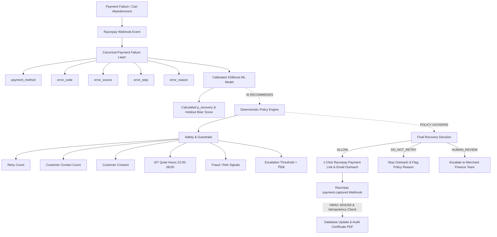

# RecoverOS — AI-Governed Payment Recovery System

**Razorpay AI Buildathon 2026 | Track 03: AI Revenue Recovery Agent**

> **One-Line Thesis**: *RecoverOS does not simply ask whether a failed payment can be retried — it decides whether recovery is safe, justified, and worth attempting.*

---

## 📌 Problem

In digital commerce, payment failures are inevitable due to bank drops, network timeouts, expired credentials, or insufficient funds. However, **not all payment failures are equivalent**:

- **Blind automated retries** burn customer trust, trigger card network penalties, and cause unnecessary bank decline fees.
- **Generic retry bots** spam customers during quiet hours (e.g. midnight IST) or repeatedly attempt retries on cards with insufficient funds.
- **Uncontrolled LLMs** can hallucinate, ignore business constraints, or attempt retries on high-risk/fraudulent transactions.

Payment recovery requires **both prediction and governance**.

---

## 💡 Core Insight: AI Recommends. Policy Governs.

```
       ┌───────────────────────────────────────────────────────────┐
       │ AI / ML ENGINE: Predicts Recovery Probability (p_recovery)│
       └─────────────────────────────┬─────────────────────────────┘
                                     │
                             (AI RECOMMENDS)
                                     │
                                     ▼
       ┌───────────────────────────────────────────────────────────┐
       │ DETERMINISTIC POLICY ENGINE: Governs Final Action        │
       │ (Quiet Hours, Contact Caps, ₹50k Limit, Stop Rules)      │
       └─────────────────────────────┬─────────────────────────────┘
                                     │
                              (POLICY GOVERNS)
                                     │
                                     ▼
       ┌───────────────────────────────────────────────────────────┐
       │ FINAL ACTION: ALLOW | DO_NOT_RETRY | UNKNOWN_HUMAN_REVIEW  │
       └───────────────────────────────────────────────────────────┘
```

- **AI/ML Model**: Predicts the calibrated probability ($p_{\text{recovery}}$) that a retry/outreach effort will succeed based on historical transaction features.
- **Policy Engine**: Holds **absolute deterministic authority**. It evaluates safety rules, customer consent, IST quiet hours, contact caps, amount limits, and risk signals.
- **Core Governance Rule**: If the AI model recommends a retry but the Policy Engine detects a rule violation, **the Policy Engine overrides the AI recommendation and blocks outreach**.

---

## 🆚 Why RecoverOS? Differentiation from Existing Retry Systems

Payment gateways like Razorpay already provide infrastructure-level auto-retries and payment link APIs. **RecoverOS does not replace Razorpay; it acts as an intelligent governance layer on top of Razorpay infrastructure.**

| Feature Focus | Standard Payment Retries | RecoverOS Governance Layer |
| :--- | :--- | :--- |
| **Primary Goal** | Maximize technical retry attempts | Decide **when NOT to retry** & govern outreach safety |
| **Failure Diagnosis** | Raw bank decline code | Canonical taxonomy mapping & fail-closed classification |
| **Outreach Timing** | Immediate / Fixed schedule | Contextual window & IST Quiet Hours (22:00–08:00 IST) |
| **Safety Guardrails** | Basic retry counters | Multi-variable rules (24h/7d caps, ₹50k human escalation, risk rules) |
| **Fail-Closed Security** | Often defaults to retry | Unknown/fraud errors fail-closed to `UNKNOWN_HUMAN_REVIEW` |
| **Auditability** | System logs | Database-authoritative idempotency & 1-click PDF Audit Certificates |

---

## 🔄 How It Works: Complete Pipeline Architecture



---

## 🧠 AI / ML Architecture & Probability Calibration

- **Model Architecture**: `CalibratedClassifierCV(estimator=XGBClassifier, method="isotonic")` in [`backend/services/ml_engine.py`](file:///Users/bhavya/recoveros/backend/services/ml_engine.py).
- **Features Extracted**:
  1. Transaction Amount (Scaled INR)
  2. Customer LTV (Lifetime Value)
  3. Customer Contact Frequency (7-day window)
  4. Failure Retry Count
  5. Canonical Failure Category Code
  6. Revenue Leak Source (Checkout Abandonment vs Payment Failure)
  7. IST Quiet Hours Flag (Boolean)
- **Train/Test Holdout & Metrics**: Trained using an **80% training / 20% holdout test split** (`train_test_split`).
- **Holdout Brier Score Loss**: Brier score loss is **calculated directly from holdout predictions** using `sklearn.metrics.brier_score_loss` (rather than hardcoded constants).
- **Synthetic Data Disclosure**: *The current ML model is trained and evaluated on a method-conditioned synthetic dataset (`SYNTHETIC_SIMULATION`). It is designed to demonstrate prototype calibration and governance logic, not production payment recovery performance.*

---

## 🏷️ Canonical Payment Failure Taxonomy

Located in [`backend/domain/payment_failures.py`](file:///Users/bhavya/recoveros/backend/domain/payment_failures.py), RecoverOS normalizes raw Razorpay failure attributes (`error_code`, `error_source`, `error_step`, `error_reason`, `payment_method`) into 8 canonical recovery classes:

| Recovery Class | Safety Classification | System Behavior |
| :--- | :--- | :--- |
| **`RETRY_FAST`** | `SAFE_TO_RETRY` | Transient network drop / gateway timeout. Safe for immediate retry. |
| **`RETRY_WHEN_BANK_UP`** | `SAFE_TO_RETRY` | Issuer bank server error. Retry scheduled after bank recovery window. |
| **`RETRY_AFTER_USER_ACTION`** | `REQUIRES_USER_ACTION` | User dropped during 2FA/OTP authentication. Send reminder link. |
| **`NEVER_SAME_CREDENTIAL`** | `UNSAFE_STOP` | Expired/invalid card. Retrying with same credential will fail. |
| **`NEVER_FRAUD`** | `UNSAFE_STOP` | Risk check failure / fraud signal. **Automatic retries strictly prohibited.** |
| **`NEVER_INSUFFICIENT_FUNDS`** | `REQUIRES_USER_ACTION` | Insufficient funds exceeding retry limits. Requires user top-up. |
| **`MERCHANT_BUG`** | `UNSAFE_STOP` | Invalid merchant credentials or API integration bug. |
| **`UNKNOWN_HUMAN_REVIEW`** | `HUMAN_REVIEW_REQUIRED` | **Fail-Closed Default.** Any unrecognized error code routes to human review. |

> [!IMPORTANT]
> **Fail-Closed Guarantee**: Security, fraud, or unknown error reasons **NEVER** silently default to a retryable network timeout. They fail closed to `UNKNOWN_HUMAN_REVIEW` or `NEVER_FRAUD`.

---

## 🛡️ Policy & Safety Guardrails Layer

Located in [`backend/services/policy_engine.py`](file:///Users/bhavya/recoveros/backend/services/policy_engine.py), the Policy Engine enforces strict stopping rules:

1. **IST Quiet Hours**: Automatic suppression between 22:00 and 08:00 IST.
2. **High-Value Escalation**: Transactions $\ge ₹50,000$ escalate to merchant human review.
3. **Contact & Retry Caps**: Maximum 3 retries and 3 contacts per customer within 24 hours.
4. **`DO_NOT_RETRY` Path**: Insufficient funds with prior retries or low probability ($p_{\text{recovery}} < 40\%$) trigger a first-class `DO_NOT_RETRY` callout.
5. **LLM Safety Guardrail**: The LLM (*Claude / OpenAI*) handles natural language formatting only. It cannot execute financial actions or override policy decisions.

---

## 🔒 Security & Reliability

- **HMAC-SHA256 Webhook Security**: Webhooks are verified using `X-Razorpay-Signature` via `hmac.compare_digest` in [`backend/utils/security.py`](file:///Users/bhavya/recoveros/backend/utils/security.py). Invalid or missing signatures are rejected with `400 Bad Request`.
- **Database-Authoritative Idempotency**: Webhook events are logged with a `UNIQUE event_id` constraint in SQLite/Postgres (`WebhookEventModel`). Duplicate webhooks return `200 OK (ignored)` with zero duplicate payment link creation.

---

## 🎬 Demo Scenarios

| Scenario | Input Failure | AI Recommendation | Policy Evaluation | Final System Action |
| :--- | :--- | :--- | :--- | :--- |
| **Scenario A: Safe Recovery** | Network Timeout (Order `#RZP-34005`, ₹2,499) | `p_recovery = 94%` (High) | IST Active, Limits OK | **`ALLOW`** $\rightarrow$ Razorpay Link Generated & Email Dispatched |
| **Scenario B: Safety Block** | Risk Check Failure (`payment_risk_check_failed`) | `p_recovery = 5%` (Unsafe) | Safety Rule Triggered | **`DO_NOT_RETRY` / `NEVER_FRAUD`** (Automated retry blocked) |
| **Scenario C: Guardrail Block** | Insufficient Funds (Order `#RZP-10982`, ₹1,200) | `p_recovery = 25%` (Low) | 3 Prior Retries Exceeded | **`🛑 DO_NOT_RETRY`** (Prevents customer spam & bank decline fees) |
| **Scenario D: Unknown Failure** | Unrecognized Error (`CUSTOM_999_ERR`) | `p_recovery = 5%` (Unknown) | Unrecognized Code | **`UNKNOWN_HUMAN_REVIEW`** (Fails closed to human review) |

---

## 📊 Synthetic Data Disclosure & Limitations

> [!NOTE]
> **Synthetic Simulation Notice**: All payment transactions and customer records in `data/payments.csv` are synthetically generated for mechanism validation. Model metrics demonstrate evaluation methodology rather than production payment-recovery performance.

### System Limitations
1. Trained on synthetic simulation data preserving plausible Indian payment distributions.
2. Webhook triggers and link generation in demo mode operate via Razorpay Sandbox / Simulation.
3. Production deployment requires live merchant transaction logging and periodic retraining.

---

## 🛣️ Production Roadmap

1. Train XGBoost model on anonymized production Razorpay transaction logs.
2. Controlled A/B testing holdout groups for merchants.
3. Cost-sensitive optimization weighing recovery value against decline fees.
4. Merchant human-in-the-loop review workflow UI.
5. Cloud deployment via Azure App Services & Docker Compose.

---

## 💻 Local Setup & Execution

### 1. Prerequisites
- Python 3.11+
- Git

### 2. Environment Setup & Tests
```bash
# Clone repository
git clone https://github.com/Bhavyakela07/recoverOS.git
cd recoverOS

# Create and activate virtual environment
python3 -m venv venv
source venv/bin/activate

# Install unified dependencies
pip install -r requirements.txt

# Run complete Pytest verification test suite
PYTHONPATH=.:backend python3 -m pytest tests/ -v
```

### 3. Launching Daemons (Backend + Web UI)
```bash
# Terminal 1: Launch FastAPI Backend Daemon (Port 8000)
PYTHONPATH=.:backend python3 -m uvicorn backend.main:app --host 0.0.0.0 --port 8000

# Terminal 2: Launch Streamlit Dashboard UI (Port 8501)
PYTHONPATH=.:backend python3 -m streamlit run app.py --server.port 8501
```

### 4. Docker Container Execution
```bash
# Build Docker image
docker build -t recoveros-ai-agent .

# Run with Docker Compose
docker compose up --build
```

---

## 🧪 Verification & Test Results

```
============================= test session starts ==============================
platform darwin -- Python 3.11.9, pytest-9.0.2
collected 33 items

tests/test_audit_comprehensive.py::test_database_schema_and_constraints PASSED [  3%]
tests/test_audit_comprehensive.py::test_postgresql_no_silent_fallback PASSED [  6%]
tests/test_audit_comprehensive.py::test_policy_quiet_hours_suppressed PASSED [  9%]
tests/test_audit_comprehensive.py::test_policy_amount_over_50k_human_review PASSED [ 12%]
tests/test_audit_comprehensive.py::test_policy_contact_cap_24h_suppressed PASSED [ 15%]
tests/test_audit_comprehensive.py::test_policy_insufficient_funds_retries_do_not_retry PASSED [ 18%]
tests/test_audit_comprehensive.py::test_ml_calibrated_xgboost_inference PASSED [ 21%]
tests/test_audit_comprehensive.py::test_backend_health_check PASSED      [ 24%]
tests/test_audit_comprehensive.py::test_webhook_security_rejections PASSED [ 27%]
tests/test_audit_comprehensive.py::test_webhook_double_delivery_idempotency PASSED [ 30%]
tests/test_audit_comprehensive.py::test_webhook_malformed_json_payload PASSED [ 33%]
tests/test_audit_comprehensive.py::test_llm_cannot_override_policy_decision PASSED [ 36%]
tests/test_audit_comprehensive.py::test_mocked_razorpay_test_mode_link_creation PASSED [ 39%]
tests/test_closed_loop.py::test_complete_closed_loop_recovery_pipeline PASSED [ 42%]
tests/test_domain_payment_failures.py::test_network_failure_classification PASSED [ 45%]
tests/test_domain_payment_failures.py::test_issuer_decline_classification PASSED [ 48%]
tests/test_domain_payment_failures.py::test_expired_card_classification PASSED [ 51%]
tests/test_domain_payment_failures.py::test_fraud_risk_classification_fail_closed PASSED [ 54%]
tests/test_domain_payment_failures.py::test_unknown_error_fail_closed_to_human_review PASSED [ 57%]
tests/test_phase2.py::test_pii_redaction PASSED                          [ 60%]
tests/test_phase2.py::test_ml_model_calibration_and_prediction PASSED    [ 63%]
tests/test_phase2.py::test_ai_reasoning_and_fallback PASSED              [ 66%]
tests/test_phase3.py::test_webhook_signature_security PASSED             [ 69%]
tests/test_phase3.py::test_double_webhook_idempotency PASSED             [ 72%]
tests/test_phase3.py::test_checkout_abandonment_sweep_detector PASSED    [ 75%]
tests/test_qa_pass_pipeline.py::test_qa_01_application_starts_and_health_check PASSED [ 78%]
tests/test_qa_pass_pipeline.py::test_qa_02_data_loading_and_db_ingestion PASSED [ 81%]
tests/test_qa_pass_pipeline.py::test_qa_03_analyzer_scoring_and_classification PASSED [ 84%]
tests/test_qa_pass_pipeline.py::test_qa_04_ml_prediction_and_calibration PASSED [ 87%]
tests/test_qa_pass_pipeline.py::test_qa_05_decision_agent_and_policy_checks PASSED [ 90%]
tests/test_qa_pass_pipeline.py::test_qa_06_message_generation_and_pii_handling PASSED [ 93%]
tests/test_qa_pass_pipeline.py::test_qa_07_end_to_end_recovery_pipeline PASSED [ 96%]
tests/test_qa_pass_pipeline.py::test_qa_08_invalid_payloads_and_security_rejections PASSED [100%]

============================== 33 passed in 0.63s ==============================
```
