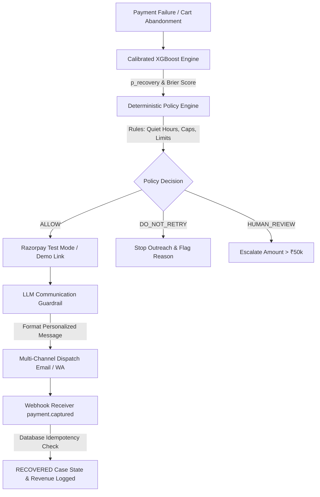

# RecoverOS — Autonomous AI Revenue Recovery Agent

**Razorpay AI Buildathon 2026 | Track 03: AI Revenue Recovery Agent**

> **Disclaimer**: RecoverOS is an independent open-source hackathon project built for the Razorpay AI Buildathon 2026. It is not officially affiliated with or endorsed by Razorpay Software Private Limited.

---

## 📌 Executive Summary

**RecoverOS** is an autonomous, policy-governed AI revenue recovery agent designed to maximize recovery of failed transactions and abandoned checkouts for online merchants.

Unlike generic automated retry bots that spam customers or trigger excessive bank decline fees, **RecoverOS decides when recovery is economically and operationally justified**, why an action should be taken, and when to stop.



---

## 🎯 Key Capabilities

1. **Governed Payment Links**: Uses the official `razorpay` Python SDK to create **Razorpay Test Mode Payment Links** (`plink_...`) when API keys exist, or operates seamlessly in an explicitly labeled **`DEMO MODE (SIMULATED)`** without credentials.
2. **Database-Authoritative Idempotency**: Stores incoming webhook events in PostgreSQL / SQLite (`webhook_events.event_id` UNIQUE constraint) to guarantee zero duplicate payment links or double-counted revenue.
3. **Calibrated Machine Learning Inference**: Employs an isotonic-calibrated XGBoost classifier (`CalibratedClassifierCV`) to output mathematically reliable recovery probability ($p_{\text{recovery}}$).
4. **Deterministic Financial Guardrails**: Enforces merchant-configurable policy rules (Quiet Hours 22:00–08:00 IST, ₹50,000 human escalation threshold, 24h contact caps).
5. **LLM Communication Guardrail**: The LLM (*OpenAI / Claude*) functions strictly as a natural language formatting layer. It **cannot** make financial decisions, issue refunds, or override policy choices.
6. **Closed-Loop Outcome Measurement**: Tracks transactions from failure to `payment.captured` webhooks, recording true incremental recovered revenue.

---

## ⚙️ Razorpay Integration: Test Mode vs. Demo Mode

| Feature | `RAZORPAY TEST MODE` | `DEMO MODE (SIMULATED)` |
| :--- | :--- | :--- |
| **Trigger** | `RAZORPAY_KEY_ID` & `RAZORPAY_KEY_SECRET` set | No API credentials configured |
| **Link Generation** | Invokes official `razorpay.Client` payment link API | Generates local simulated link (`http://localhost:8501/?demo_pay=...`) |
| **Link ID Format** | Official Razorpay link ID (`plink_...`) | Simulated link ID (`plink_demo_...`) |
| **UI Badge** | `🟢 RAZORPAY TEST MODE` | `🟡 DEMO MODE (SIMULATED)` |
| **Transaction Nature** | Razorpay Sandbox / Test Mode | Local simulation (No real payment network calls) |

---

## 🧠 ML Architecture & Calibration

- **Authoritative Production Model**: `CalibratedClassifierCV(XGBClassifier, method="isotonic")` in [`backend/services/ml_engine.py`](file:///Users/bhavya/recoveros/backend/services/ml_engine.py).
- **Offline Benchmark Baseline**: `RandomForestClassifier` in [`models/recovery_model.py`](file:///Users/bhavya/recoveros/models/recovery_model.py) retained strictly for offline model comparison.
- **Evaluation Labeling**: Because training relies on a synthetic demo dataset, metrics are transparently labeled as **`Synthetic-Dataset Evaluation Baseline`** and probabilities are displayed in the UI as **`Model-estimated recovery probability`**.

---

## 🛡️ Financial Safety & Policy Engine

RecoverOS enforces strict deterministic stopping rules before any customer contact or link creation is attempted:

- **IST Quiet Hours**: Outreach is automatically `SUPPRESSED` between 22:00 and 08:00 IST.
- **High-Value Escalation**: Transactions exceeding ₹50,000 escalate to `HUMAN_REVIEW`.
- **24-Hour Contact Caps**: Maximum 3 customer contacts per 24-hour window.
- **`DO_NOT_RETRY` Path**: Insufficient funds failures with $\ge 2$ previous retries or low probability ($p_{\text{recovery}} < 40\%$) trigger a first-class `DO_NOT_RETRY` status callout.

---

## 🔄 Closed-Loop Payment Lifecycle

```
FAILED ──► ANALYZING ──► RECOVERY_RECOMMENDED ──► RECOVERY_LINK_CREATED ──► CUSTOMER_CONTACTED ──► PAYMENT_CAPTURED ──► RECOVERED
```

- `payment.failed`: Parses failure code, runs ML inference & Policy Engine, persists `RevenueLeakModel` & `RecoveryCaseModel`.
- `payment.captured` / `order.paid`: Matches case by payment ID / link ID, transitions lifecycle status to **`RECOVERED`**, logs recovered amount in database, and updates dashboard metrics.

---

## 🚀 Quickstart & Setup

### 1. Prerequisites
- Python 3.11+
- Virtual environment (`venv` or `conda`)

### 2. Installation
```bash
# Clone repository
git clone https://github.com/Bhavyakela07/recoverOS.git
cd recoverOS

# Create and activate virtual environment
python3 -m venv venv
source venv/bin/activate

# Install dependencies
pip install -r requirements.txt
pip install -r backend/requirements.txt
```

### 3. Run Application (Zero-Config DEMO MODE)
```bash
# Terminal 1: Launch FastAPI Policy & Webhook Backend (Port 8000)
PYTHONPATH=backend python3 -m uvicorn backend.main:app --host 0.0.0.0 --port 8000

# Terminal 2: Launch Streamlit Frontend (Port 8501)
python3 -m streamlit run app.py --server.port 8501
```
Open **[http://localhost:8501](http://localhost:8501)** in your browser.

---

## 🧪 Test Suite Execution

Run the complete 20-test automated verification suite:

```bash
PYTHONPATH=backend:. pytest -v
```

```
collected 20 items

tests/test_audit_comprehensive.py::test_database_schema_and_constraints PASSED
tests/test_audit_comprehensive.py::test_postgresql_no_silent_fallback PASSED
tests/test_audit_comprehensive.py::test_policy_quiet_hours_suppressed PASSED
tests/test_audit_comprehensive.py::test_policy_amount_over_50k_human_review PASSED
tests/test_audit_comprehensive.py::test_policy_contact_cap_24h_suppressed PASSED
tests/test_audit_comprehensive.py::test_policy_insufficient_funds_retries_do_not_retry PASSED
tests/test_audit_comprehensive.py::test_ml_calibrated_xgboost_inference PASSED
tests/test_audit_comprehensive.py::test_backend_health_check PASSED
tests/test_audit_comprehensive.py::test_webhook_security_rejections PASSED
tests/test_audit_comprehensive.py::test_webhook_double_delivery_idempotency PASSED
tests/test_audit_comprehensive.py::test_webhook_malformed_json_payload PASSED
tests/test_audit_comprehensive.py::test_llm_cannot_override_policy_decision PASSED
tests/test_audit_comprehensive.py::test_mocked_razorpay_test_mode_link_creation PASSED
tests/test_closed_loop.py::test_complete_closed_loop_recovery_pipeline PASSED
tests/test_phase2.py::test_pii_redaction PASSED
tests/test_phase2.py::test_ml_model_calibration_and_prediction PASSED
tests/test_phase2.py::test_ai_reasoning_and_fallback PASSED
tests/test_phase3.py::test_webhook_signature_security PASSED
tests/test_phase3.py::test_double_webhook_idempotency PASSED
tests/test_phase3.py::test_checkout_abandonment_sweep_detector PASSED

============================== 20 passed in 1.62s ==============================
```

---

## 📁 Repository Structure

```
recoverOS/
├── app.py                          # Streamlit UI Dashboard & Navigation
├── backend/
│   ├── api/                        # FastAPI Routers (webhooks, health, cases, demo)
│   ├── db/                         # SQLAlchemy Database engine, session, & 9 ORM schemas
│   ├── services/                   # Business logic (Razorpay service, Policy Engine, ML, AI)
│   └── utils/                      # Security HMAC verification & helpers
├── agents/                         # AI decision & message generation agents
├── models/                         # ML models (authoritative XGBoost & benchmark RandomForest)
├── data/                           # Data generator & synthetic dataset
├── tests/                          # Automated Pytest QA & integration test suites
├── Dockerfile                      # Containerization specification
├── docker-compose.yml              # Multi-container orchestration (Backend + Postgres)
├── DOCUMENTATION.md                # Comprehensive technical documentation
├── PITCH_SCRIPT.md                 # 3-Minute Hackathon Demo Script
└── FINAL_SUBMISSION_AUDIT.md       # Judge-facing submission verification audit checklist
```
